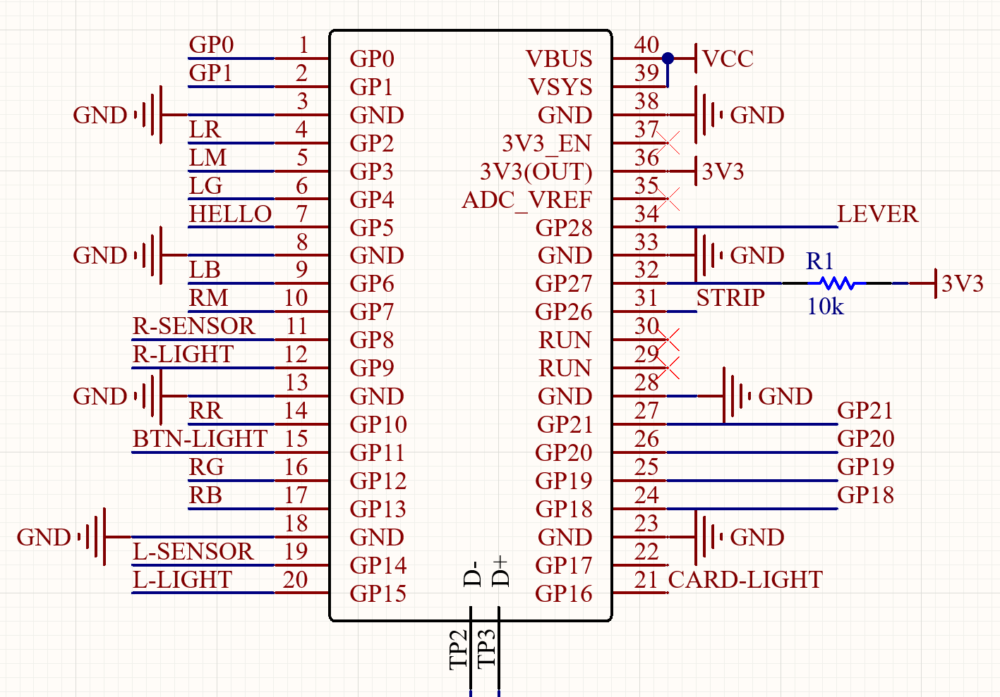

# RP2040 IO4

## Setup

1. Make sure you have [GNU Arm Embedded Toolchain](https://developer.arm.com/tools-and-software/open-source-software/developer-tools/gnu-toolchain/gnu-rm/downloads) installed
2. Clone this repo
3. Run ``git submodule update --init --recursive``
4. plz ref to [pico official doc](https://datasheets.raspberrypi.com/pico/getting-started-with-pico.pdf) page 52 (I am using CLion)

## Pins
It is recommended to check the pico official documentation for pin definitions.

Card Reader (PN532/HSU mode): GP0/GP1

HELLO: Multifunction Key

BTN-LIGHT(WS2812): Button Light. Order: Right123, Left123.

CARD-LIGHT(WS2812): Card reader light

Angle sensor(I2C): For lever. Optional for replacing potentiometers. GP21/GP20. PandAuto P3022-I2C-CW360-3.3-L

STRIP/GP27/GP19/GP18: No use for now

